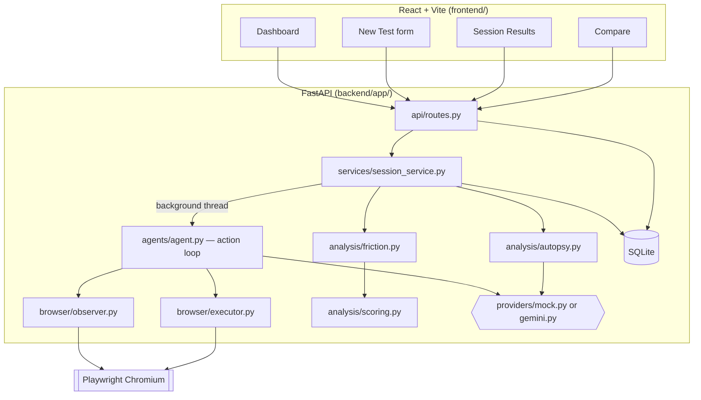

# UX Autopsy — AI-Powered UX Debugger

Run a synthetic user against your website, watch it attempt a real task in a
real browser, and get a deterministic UX score plus a root-cause "autopsy" of
what went wrong — before your real users hit the same friction.

## Problem

UX research is slow and expensive: recruiting testers, watching session
recordings, and manually tagging friction points takes days. Bugs and
confusing flows often ship because nobody actually *tried the task* before
release.

## Solution

UX Autopsy automates the first pass. Give it a URL, a task in plain English,
and a synthetic persona; it drives a real headless browser through the task,
records every action, computes a UX score from deterministic heuristics, and
writes up an autopsy — observed behavior, likely cause, and a concrete
recommendation for each friction point.

## Core workflow

```
Website URL + Task + Persona
        │
        ▼
  Browser automation (Playwright)
        │
        ▼
  Interaction events recorded
        │
        ▼
  Friction detection (deterministic heuristics)
        │
        ▼
  UX score (deterministic formula)
        │
        ▼
  Root-cause analysis (LLM or heuristic narrative)
        │
        ▼
  UX report → Before/after comparison
```

## Features

- **Persona-differentiated behavior, not just labels** — Budget Shopper,
  Impatient User, Confused Beginner, Power User, and Mobile User each take a
  genuinely different path through the same page (see below), or describe a
  free-text custom persona.
- **Real browser automation** — Playwright drives an actual Chromium
  instance; no simulated DOM.
- **Structured, whitelisted actions** — the agent can only click/type/scroll/
  navigate back/wait/finish/fail against element IDs it was shown. It cannot
  execute arbitrary code or invent selectors.
- **Deterministic UX scoring** — a fixed formula (completion, efficiency,
  navigation, recovery, friction), never altered by an LLM.
- **Evidence-based friction detection** — repeated clicks, low-confidence
  ("incorrect") clicks, backtracking, real hesitation, interaction errors,
  dead ends, abandonment, excessive actions, and explicit task failure. Every
  friction point carries its evidence as bullet-point facts, not a bare
  label.
- **Root-cause "autopsy"** — separates *observed behavior* from *possible
  cause* from *likely root cause* from *recommendation* from *confidence*,
  using hedged language ("likely", "evidence suggests") for anything
  inferred.
- **"Why did this happen?"** — an expandable panel per friction point,
  generated from that point's own recorded evidence (not a fresh guess).
- **Screenshot evidence in the timeline** — each step is screenshotted, and
  expanding a timeline event shows its timestamp, URL, element, reasoning,
  any related friction, and the screenshot itself (with a graceful fallback
  if one is missing).
- **Demo mode, no API key required** — a deterministic heuristic provider
  drives the whole pipeline end-to-end against a bundled demo store.
- **Session comparison** — pick up to three completed sessions and compare
  UX scores side by side (e.g. before/after a UI fix).

## Architecture



**Backend**: FastAPI + a thin, thread-safe SQLite layer (no ORM). Each test
run spawns a background thread that drives Playwright through an
observe → decide → act loop, recording every step as an event.

**Frontend**: React + Vite + TypeScript + Tailwind, polling the session
endpoint while a test runs and rendering the score, friction list, timeline,
and autopsy once it completes.

## Tech stack

| Layer | Choice |
|---|---|
| Backend | FastAPI, Uvicorn, Pydantic v2 |
| Browser automation | Playwright (sync API), Chromium |
| Database | SQLite (raw `sqlite3`, no ORM) |
| LLM provider | Google Gemini (`google-generativeai`), optional |
| Frontend | React 18, Vite, TypeScript, Tailwind CSS, Recharts |
| Testing | pytest (unit + API), Playwright Test (E2E) |

## AI architecture — how decisions are made safely

At each step the agent hands the provider a **structured observation**: page
title/URL, a short list of interactive elements tagged with sequential IDs
(`button_01`, `input_02`, `link_01`, …), and recent action history. The
provider must respond with **one structured action**:

```json
{"action": "click", "target": "button_01", "reason": "...", "confidence": 0.9}
```

The executor validates the action against a fixed whitelist
(`click | type | scroll | navigate_back | wait | finish | fail`) and checks
the target ID actually exists on the current page before doing anything.
Malformed or unsafe output falls back to a harmless `wait`. **There is no
path for the model to run arbitrary code or use a raw CSS selector.**

Two providers implement this interface:

- **Mock provider** (`providers/mock.py` + `agents/heuristic.py`) — pure
  Python keyword-matching heuristics. No network calls. This is what powers
  demo mode.
- **Gemini provider** (`providers/gemini.py`) — prompts Gemini for the same
  structured JSON, parsed by `providers/parsing.py` (fence-stripping,
  balanced-brace extraction, and schema validation — robust to markdown
  fences and surrounding prose, not just bare JSON), with the same target-ID
  validation. If Gemini's autopsy call fails or returns unparseable output,
  it falls back to the mock provider's narrative — but that fallback is
  always recorded and surfaced (`analyses.provider`/`fallback`/
  `fallback_reason`, shown on the results page), never presented as if
  Gemini produced it.

The **numerical UX score is never produced by an LLM** — it comes from
`analysis/scoring.py`, a fixed weighted formula. The LLM (or, in demo mode,
the heuristic narrative generator) only ever writes the qualitative summary
and root-cause text, and even then is instructed to hedge inference
("likely cause", "evidence suggests") rather than assert it as fact.

The `confidence` value each provider reports per action has a second job
beyond narrative color: `analysis/friction.py` treats a genuinely
low-confidence click (the provider's own uncertainty at decision time) as
evidence of an "incorrect click" — this is why a necessary multi-step flow
(open a filter, pick a bracket, open checkout, confirm) is never flagged as
friction just because only its last click is literally last, while a real
wrong turn (confidence well below the rest of the session) is.

## Browser automation

`agents/agent.py` runs the loop: observe the page → ask the provider for one
action → validate it → execute it → record an event → repeat, capped by
`MAX_ACTIONS` and `MAX_SESSION_SECONDS`. Every step also enforces a
navigation limit and an 8s (configurable) per-action timeout so a stuck page
can't hang a session indefinitely. If the target site fails to load at all,
the session ends in `failed` with the underlying error captured — it never
gets left in a half-finished state.

## UX scoring

`analysis/scoring.py` blends five deterministic sub-scores into one overall
number:

| Component | Weight | What it measures |
|---|---|---|
| Completion | 35% | Did the agent reach `finish`? |
| Efficiency | 20% | Actions taken vs. a reasonable baseline |
| Navigation | 15% | Backtracking and excess page navigations |
| Recovery | 15% | Interaction errors, and whether the agent recovered |
| Friction | 15% | Total weighted friction-point penalty |

## Demo mode

With no `GEMINI_API_KEY` set, `LLM_PROVIDER=auto` resolves to the mock
provider automatically — the app is fully usable out of the box. The
built-in demo target (`GET /api/demo-site/`) is a small, self-contained
electronics store ("PixelMart") purpose-built for the demo task ("find a
laptop under ₹60,000 and complete the purchase"), with **deliberate,
realistic UX friction points** rather than a scripted happy path:

- "Add to Cart" and "Buy Now" sit side by side — a plausible wrong first
  click for a persona that doesn't read carefully.
- The price filter is a low-contrast text toggle grouped tightly next to the
  sort pills, easy to overlook.
- At a narrow (mobile) viewport, the filter/sort controls collapse behind a
  "☰ Menu" button — a real, structural source of mobile-only friction.

None of this is randomized — the same persona against the same page takes
the same path every time, but which controls it tries (and whether it makes
a wrong first attempt) genuinely differs by persona, not just by narration.
`GET /api/health` reports `"demo_mode": true` whenever the mock fallback is
active.

### How personas actually differ

| Persona | Behavior | Typical evidence |
|---|---|---|
| Budget Shopper | Searches, then opens the filter panel and narrows by price before buying | A few extra actions vs. the minimal path; no friction if the filter is found cleanly |
| Power User | Skips search entirely — goes straight to category + price filters | The shortest, most direct action count |
| Confused Beginner | Clicks "Add to Cart" before finding "Buy Now"; pauses ~7s before retrying | `incorrect_click` (a real low-confidence click) + `hesitation` (a real timed pause) |
| Impatient User | Clicks the first prominent control (a sort pill) before reading anything | `incorrect_click` from a genuinely wasted first action |
| Mobile User | Runs at a 390×844 viewport; the filter is hidden behind a mobile menu | An extra "open menu" action that desktop personas never need |

Every one of these differences shows up as real Playwright actions and real
event timestamps — friction detection and scoring run on that data exactly
like they would for a real website, never on hand-authored session data.

## Installation

Prerequisites: Python 3.10+, Node 18+.

```bash
# Backend
cd backend
python -m venv .venv
.venv\Scripts\activate          # Windows; use `source .venv/bin/activate` on macOS/Linux
pip install -r requirements.txt
python -m playwright install chromium

# Frontend (new terminal)
cd frontend
npm install
```

## Environment variables

Copy `.env.example` to `.env` in the project root and adjust as needed (see
that file for the full list). The only one you're likely to set is:

| Variable | Default | Purpose |
|---|---|---|
| `GEMINI_API_KEY` | unset | Enables the real Gemini provider. Omit it to stay in demo mode. |
| `LLM_PROVIDER` | `auto` | `auto` \| `gemini` \| `mock` |

## Running locally

Run these from the **project root** (`ux-autopsy/`), not from `backend/` —
the backend package is imported as `backend.app.*`:

```bash
# Terminal 1 — backend (from the project root, with the venv activated)
python -m uvicorn backend.app.main:app --reload --port 8000

# Terminal 2 — frontend
cd frontend
npm run dev
```

Open http://localhost:5173, click **View Demo** on the dashboard, then
**Start UX Test**. `GET http://localhost:8000/api/health` should report
`{"status":"ok","demo_mode":true}` with no API key configured.

## Testing

The normal test suites below **never contact the real Gemini API**, even on
a machine whose `.env` has `LLM_PROVIDER=gemini` and a real
`GEMINI_API_KEY` configured. See "Test isolation from Gemini" below for how.

```bash
# Backend — unit + API tests (the API test drives a real Playwright session
# against the built-in demo site, so start uvicorn first, as above — but the
# session's own decisions always use the deterministic mock provider,
# regardless of how that uvicorn process itself is configured; see below)
cd backend
pytest -v

# Backend type-check (optional; pip install pyright first)
pyright

# Frontend type-check
cd frontend
npx tsc -b

# Frontend E2E — Playwright manages its own backend + frontend servers for
# this run (forcing the mock provider on the backend it spawns), so do not
# pre-start either server yourself before running this.
cd frontend
npx playwright install chromium
npx playwright test
```

### Test isolation from Gemini

`backend/tests/conftest.py` forces `LLM_PROVIDER=mock` for every `pytest`
process, regardless of `.env` — no application code was changed to achieve
this, since `LLM_PROVIDER=mock` was already a supported, documented
override; it's just now applied consistently for test runs. As defense in
depth, the same file also monkeypatches the real Gemini SDK's
`generate_content` to raise loudly if anything ever calls it for real during
a test run, rather than silently reaching the live API
(`backend/tests/test_provider_isolation.py` asserts both of these hold).

`test_api.py`'s session still needs a real `uvicorn` process listening on
`:8000` for its Playwright browser to load the built-in demo site page —
that's a plain HTTP page fetch, unrelated to Gemini. The session's actual
*decisions*, though, are made by calling `run_agent()` directly inside the
`pytest` process itself (`session_service.create_session()` spawns a
background thread in that same process, it does not delegate to the
separately-running `uvicorn` process) — so provider resolution always uses
`pytest`'s own environment, which `conftest.py` has forced to `mock`,
**regardless of how that standalone `uvicorn` process was configured**.

The Playwright E2E suite drives the app through the real browser, so
isolating it means controlling how its backend is started: `webServer` in
`frontend/playwright.config.ts` has Playwright spawn the backend itself with
`LLM_PROVIDER=mock` forced in that process's environment (and
`reuseExistingServer: false`, so a leftover manually-started server —
possibly configured for real Gemini — is never silently reused).

### Live Gemini regression (manual, consumes real quota)

There is exactly one intentional path to a real Gemini API call in this
repo's tooling: `backend/scripts/live_gemini_regression.py`. It is a plain
script, not a pytest test — `pytest`/`playwright test` never run it.

```bash
# 1. Configure .env for real Gemini (LLM_PROVIDER=gemini/auto + GEMINI_API_KEY)
#    and start the backend normally:
python -m uvicorn backend.app.main:app --port 8000

# 2. Explicitly opt in and run the script (from the project root):
UX_AUTOPSY_ALLOW_LIVE_GEMINI=1 backend/.venv/Scripts/python.exe \
    backend/scripts/live_gemini_regression.py
```

It refuses to run without `UX_AUTOPSY_ALLOW_LIVE_GEMINI=1`, and refuses if
the backend it finds isn't actually resolving to the `gemini` provider. Run
it deliberately and sparingly — the free tier has a low daily request quota.

**Custom task text containing `$` (e.g. a price) — never double-quote it.**
A real run once passed `--task "Find a laptop priced below $800..."` in bash
double quotes; bash expanded `$800` into positional parameter `$8` (empty)
followed by `00`, silently sending the wrong task to Gemini. Two safe
alternatives, in order of robustness:

```bash
# Safest — immune to shell quoting in any shell (bash/PowerShell/cmd.exe):
echo -n 'Find a laptop priced below $800 and add it to the cart.' > /tmp/task.txt
UX_AUTOPSY_ALLOW_LIVE_GEMINI=1 backend/.venv/Scripts/python.exe \
    backend/scripts/live_gemini_regression.py --task-file /tmp/task.txt

# Also safe — single quotes never expand variables:
UX_AUTOPSY_ALLOW_LIVE_GEMINI=1 backend/.venv/Scripts/python.exe \
    backend/scripts/live_gemini_regression.py \
    --task 'Find a laptop priced below $800 and add it to the cart.'
```

The script also prints the resolved task text (`Task: '...'`) before creating
the session, and its per-event report line now includes `decide_ms` (Gemini
API latency) and `observe_ms` (time spent reading the page's current state
via Playwright) so a large unexplained gap between events can be attributed
— or shown to be unattributed by either — without guessing.

## Limitations

- The mock provider's decisions are still keyword/DOM-structure heuristics,
  not real reasoning — they're tuned specifically against the bundled demo
  site's markup, so pointing demo-mode personas at an arbitrary real website
  won't reproduce this same nuanced behavior (the Gemini path handles
  arbitrary sites; the mock path is a demo, not a general-purpose agent).
- The `incorrect_click` friction signal combines two independent detectors:
  self-reported low confidence, and a mismatch between the provider's stated
  `reason` and the label of what it actually clicked. A provider that always
  reports high confidence *and* never states a specific reason (an empty or
  generic `reason` string) can still under-report this signal, since neither
  detector has anything to compare against.
- The real-Gemini free tier has a low daily request quota (as observed:
  20 requests/day for a `generativelanguage.googleapis.com` model on the
  free tier) — a single test suite run plus a full ~25-action session can
  exhaust it, after which the app correctly falls back to `wait`/mock
  behavior rather than crashing, but no further real Gemini decisions are
  possible until the quota resets.
- SQLite with a single writer lock is fine for local/demo use, not for
  concurrent production traffic.
- No authentication — this is a local developer/demo tool, not intended to
  be exposed publicly as-is.
- URL validation is intentionally minimal (scheme + host present); this is a
  local UX-testing tool, not a hardened public-facing scanner.

## Future improvements

- Persona-aware heuristics for arbitrary (non-demo) websites in the mock
  path, not just the bundled demo site.
- Multi-page task support with richer navigation-graph friction analysis.
- Postgres option for multi-user / production deployments.
