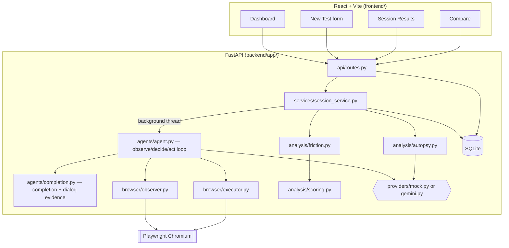

# UX Autopsy

AI-powered UX testing that watches a synthetic user actually attempt your task in a real browser, then explains — with evidence, not vibes — where and why it struggled.

UX Autopsy drives a real headless Chromium browser through a plain-English task, records every action it takes, and turns that recorded evidence into a deterministic UX score and a root-cause "autopsy." It runs out of the box in a fully deterministic **Demo Mode** (no API key needed), and can optionally drive **real websites** with a live **Google Gemini** provider.

## Why UX Autopsy?

Traditional UX testing means recruiting testers, watching session recordings, and manually tagging friction points — slow, expensive, and easy to skip under deadline pressure. Confusing flows and broken affordances often ship because nobody actually *tried the task* before release.

UX Autopsy automates that first pass: give it a URL, a task, and a persona, and it drives a real browser through the task exactly the way a first-time user of that persona would, collects hard interaction evidence (clicks, timestamps, screenshots, confidence, dialogs), and turns that evidence into a report you can act on — not a black-box "AI verdict."

## What It Does

Everything below is implemented and covered by tests in this repository:

- **Persona-differentiated behavior, not just labels** — Budget Shopper, Impatient User, Confused Beginner, Power User, and Mobile User each take a genuinely different path through the same page, or describe a free-text custom persona.
- **Real browser automation** — Playwright drives an actual Chromium instance; no simulated DOM.
- **Structured, whitelisted actions** — the agent can only click/type/scroll/navigate back/wait/finish/fail against element IDs it was actually shown. It cannot execute arbitrary code or invent a CSS selector.
- **Interaction timeline** — every action is recorded as an event with a timestamp, URL, element, reasoning, and confidence.
- **Screenshot evidence** — each step is screenshotted; expanding a timeline event shows the screenshot alongside its metadata, with a graceful fallback if one is missing.
- **Deterministic UX scoring** — a fixed formula (completion, efficiency, navigation, recovery, friction), never produced or altered by an LLM.
- **Evidence-based friction detection** — repeated clicks, low-confidence ("incorrect") clicks, backtracking, real (latency-corrected) hesitation, interaction errors, dead ends, abandonment, excessive actions, and explicit task failure. Every friction point carries its evidence as bullet-point facts, not a bare label.
- **Confidence-aware incorrect-click detection** — flags a click both when the provider itself reported low confidence *and* when its stated reasoning doesn't match what it actually clicked, so a real wrong turn is caught even when the model is confidently wrong.
- **"Why did this happen?"** — an expandable panel per friction point, generated from that point's own recorded evidence, not a fresh guess.
- **Friction ↔ timeline cross-referencing** — a friction-causing event is linked back to its timeline entry with a severity badge.
- **Dialog evidence capture** — native browser dialogs (`alert`/`confirm`/`prompt`) are captured, logged as their own `DIALOG` timeline event, and never allowed to block the session (see [UX Autopsy v1.4](#ux-autopsy-v14)).
- **Completion evidence** — a site-agnostic signal (task-keyword overlap against the current page, and against any captured dialog) tells the model when the requested end state looks satisfied, with a conservative two-consecutive-signal safety net before the harness ever overrides the model itself.
- **Root-cause autopsy** — separates *observed behavior* from *possible cause* from *likely root cause* from *recommendation* from *confidence*, using hedged language ("likely", "evidence suggests") for anything inferred.
- **Provider provenance** — the results page always shows which provider actually produced the action decisions and which produced the autopsy narrative, with an explicit "this text was NOT generated by Gemini" note whenever a fallback occurred. No fallback is ever silently presented as a real Gemini result.
- **Session comparison** — pick up to three completed sessions and compare UX scores side by side (e.g. before/after a UI fix).
- **Two providers, one interface** — a deterministic Mock provider (Demo Mode) and a real Gemini provider, both implementing the exact same structured-action contract.

## How It Works

```
User
  │
  ▼
React Frontend  (create a test: URL + task + persona)
  │
  ▼
FastAPI Backend  (session created, background thread spawned)
  │
  ▼
UX Agent  (observe → decide → act loop)
  │
  ▼
Playwright Browser  (real Chromium)
  │
  ▼
Website  (bundled demo site, or a real site in Gemini live mode)
  │
  ▼
Interaction Evidence  (events, screenshots, confidence, dialogs)
  │
  ▼
Friction Analysis  (deterministic heuristics + UX score)
  │
  ▼
UX Autopsy Report  (root-cause narrative, evidence-linked)
```

At each step the agent hands the active provider a **structured observation** — page title/URL, a short list of interactive elements tagged with sequential IDs (`button_01`, `input_02`, …), and recent action history — and the provider must respond with **one structured action**:

```json
{"action": "click", "target": "button_01", "reason": "...", "confidence": 0.9}
```

The executor validates the action against a fixed whitelist (`click | type | scroll | navigate_back | wait | finish | fail`) and checks the target ID actually exists on the current page before doing anything. Malformed or unsafe output falls back to a harmless `wait` — **there is no path for the model to run arbitrary code or use a raw CSS selector.**

The **numerical UX score is never produced by an LLM** — it comes from a fixed weighted formula in `analysis/scoring.py`. The provider (Gemini, or the heuristic narrative generator in Demo Mode) only ever writes the qualitative summary and root-cause text.

## Architecture



**Backend**: FastAPI + a thin, thread-safe SQLite layer (no ORM). Each test run spawns a background thread that drives Playwright through an observe → decide → act loop, recording every step as an event.

**Frontend**: React + Vite + TypeScript + Tailwind, polling the session endpoint while a test runs and rendering the score, friction list, timeline, and autopsy once it completes.

**Provider abstraction**: `providers/mock.py` (deterministic, no network) and `providers/gemini.py` (real Gemini calls) implement the identical action interface, so the rest of the pipeline — friction detection, scoring, the frontend — never knows or cares which one produced a given decision.

## Personas

| Persona | Behavior | Typical evidence (Demo Mode) |
|---|---|---|
| Budget Shopper | Searches, then opens the filter panel and narrows by price before buying | A few extra actions vs. the minimal path; no friction if the filter is found cleanly |
| Power User | Skips search entirely — goes straight to category + price filters | The shortest, most direct action count |
| Confused Beginner | Clicks "Add to Cart" before finding "Buy Now"; pauses ~7s before retrying | `incorrect_click` + `hesitation` (a real timed pause) |
| Impatient User | Clicks the first prominent control (a sort pill) before reading anything | `incorrect_click` from a genuinely wasted first action |
| Mobile User | Runs at a 390×844 viewport; the filter is hidden behind a mobile menu | An extra "open menu" action that desktop personas never need |

In Demo Mode, persona behavior is driven by a per-persona profile in `agents/heuristic.py` — which controls to try, in what order, with a plausible wrong-first-attempt for some personas and a real timed pause for Beginner. In Gemini live mode, the persona description is instead handed to Gemini as context, and the model's own reasoning determines the path — persona differentiation there comes from the model, not a scripted profile.

Every difference above shows up as real Playwright actions and real event timestamps; friction detection and scoring run on that recorded data exactly like they would for a real website, never on hand-authored session data.

## Evidence & Explainability

UX Autopsy is deliberately evidence-driven rather than "trust the AI's summary": every claim in a report traces back to something the agent actually recorded.

- **Screenshots** at every step, shown alongside the timeline event they belong to.
- **Timeline events** with timestamp, URL, element, and the provider's own stated reasoning.
- **Action metadata** — each action carries the provider's self-reported `confidence`, used as real signal, not decoration.
- **Hesitation** — the gap between actions, with measured Gemini API latency (`decide_ms`) subtracted out first, so a slow model response is never misreported as a user pausing.
- **Incorrect-click signals** — self-reported low confidence, *and* a reasoning/target mismatch (the model says it's clicking A but the label of what it clicked is B).
- **Dialog evidence** — a captured native browser dialog (e.g. "Product added") is relevance-checked against the task's own words and, when relevant, becomes both a `DIALOG` timeline event and a completion signal.
- **Friction ↔ timeline cross-references** — a friction point links back to the exact event that caused it.
- **"Why did this happen?"** — generated per friction point from that point's own recorded evidence, never a fresh, unmoored explanation.
- **Provider provenance** — every report states, plainly, whether the action decisions and the autopsy narrative came from Gemini or from a fallback, so a Mock-generated narrative is never mistaken for a real Gemini result.

## Demo Mode

Demo Mode is fully deterministic and requires no API key. With no `GEMINI_API_KEY` set, `LLM_PROVIDER=auto` resolves to the mock provider automatically. It's designed for:

- local development without any external dependency
- reproducible demonstrations (the same persona against the same page takes the same path every time)
- running the automated test suite without touching a real API
- portfolio/demo walkthroughs
- any environment without Gemini API access or quota

The built-in demo target (`GET /api/demo-site/`) is a small, self-contained electronics store, **PixelMart**, purpose-built for the demo task ("find a laptop under ₹60,000 and complete the purchase"), with deliberate, realistic UX friction rather than a scripted happy path — "Add to Cart" and "Buy Now" sit side by side, the price filter is a low-contrast toggle easy to overlook, and at a narrow viewport the filter/sort controls collapse behind a "☰ Menu" button. None of this is randomized, but which controls a given persona tries — and whether it makes a wrong first attempt — genuinely differs by persona. `GET /api/health` reports `"demo_mode": true` whenever the mock fallback is active.

## Gemini Live Mode

Gemini live mode points the same agent loop at a real website and lets Google Gemini make the actual decisions, instead of the scripted heuristic.

**Setup:**

```bash
# In .env (project root):
LLM_PROVIDER=gemini        # or "auto" with GEMINI_API_KEY set
GEMINI_API_KEY=<your key>  # never commit this
GEMINI_MODEL=gemini-1.5-flash   # or another Gemini model your key can access
```

`GET /api/health` reports `"provider": "gemini"` once configured correctly. **The API key is never logged, printed, or exposed anywhere in this repository's tooling.**

Gemini live mode can test arbitrary real websites — the mock path is tuned specifically for the bundled PixelMart demo site and cannot generalize the same way. It does, however, depend on external factors outside this project's control: Gemini API availability, and — notably on the free tier — a low daily request quota (observed: 20 requests/day per project/model for `generativelanguage.googleapis.com`). See [Current Validation](#current-validation) below for exactly what has and hasn't been live-validated as a result.

There is exactly one intentional path to a real Gemini API call in this repo's tooling: `backend/scripts/live_gemini_regression.py`, a manual script (never run by `pytest` or `playwright test`) that requires an explicit opt-in (`UX_AUTOPSY_ALLOW_LIVE_GEMINI=1`) and refuses to run unless the backend it's pointed at actually reports `provider: gemini`.

## Current Validation

| Suite | Result |
|---|---|
| `pytest` (backend unit + API tests) | **72 passed** |
| `pyright` (backend type-check) | clean — 0 errors, 0 warnings, 0 informations |
| `tsc -b` (frontend type-check) | clean |
| `npx playwright test` (frontend E2E) | **2 passed** |
| v1.3.2 Playwright observation stall (previously ~181s) | **live-validated as fixed** — real Gemini live runs since the fix complete in under 90s total |
| v1.4 dialog/completion evidence — **live** validation | **currently inconclusive** |

All four automated suites above run against the deterministic mock provider and never make a real Gemini call, even on a machine configured for real Gemini (see `backend/tests/conftest.py` and `frontend/playwright.config.ts` — both force `LLM_PROVIDER=mock` for their own process regardless of `.env`).

**Be clear about what "inconclusive" means here:** the most recent live Gemini regression runs against `https://www.demoblaze.com/` returned `429 ResourceExhausted` (the free-tier daily quota) on effectively every decision, before the agent could ever reach a real click. This means the new `DIALOG` evidence added in v1.4 has been verified by unit/integration tests against local fixtures (no live API, no live site) — see [UX Autopsy v1.4](#ux-autopsy-v14) — but **not yet against a real, successful live Gemini session end-to-end**. This is a stated quota limitation, not a claimed pass and not a known defect. Re-running `backend/scripts/live_gemini_regression.py` once quota is available is the natural next step, and this README will be updated once that run succeeds.

## UX Autopsy v1.4

v1.4 strengthens the evidence used to decide a task is actually complete.

**Problem:** the v1.3.2 baseline showed a model-issued `finish` trusted right after a successful "Add to cart" click, backed only by a page-text keyword match (the word "cart") — DemoBlaze's nav bar makes that keyword permanently true regardless of whether anything was actually added, so it's weaker evidence than it looks.

**What changed:**

- `capture_dialogs()` (`agents/agent.py`) — a generic Playwright dialog listener that records each native browser dialog's type and message, then dismisses it, preserving the exact auto-dismiss behavior Playwright already applies with no listener registered. **The dialog never blocks the agent.**
- `dialog_completion_evidence()` (`agents/completion.py`) — relevance-gated evidence derived purely from keyword overlap between a captured dialog's text and the task's own words (via a small, site-agnostic prefix-match helper for simple inflections like add/added). A dialog only ever reflects the single action that just ran, so — unlike the persistent page-text check — it can't be fooled by a permanently-true nav-bar keyword.
- The dialog hint feeds into the **same** `completion_hint` channel the existing `completion_evidence()` already used. `evaluate_completion()`'s existing two-consecutive-signal safety net applies unchanged, and a model-issued `finish` remains trusted unconditionally, exactly as before — this only gives the model (and the safety net) better evidence, it never gates or blocks completion.
- Each captured dialog also becomes its own `DIALOG` timeline event, using only existing `events` table columns — no schema migration, no frontend change required (the timeline already renders unknown event types generically).
- **8 new tests** (`backend/tests/test_dialog_evidence.py`) cover: real dialog capture without blocking, relevant vs. irrelevant dialog text, no-dialog behavior, the "finish is trusted unconditionally" boundary at the executor layer, and two full local-fixture sessions (Mock provider, no Gemini, no live site) proving the `DIALOG` event is DB-schema-compatible end to end.
- **The existing completion-trust boundary is unchanged**: `completion_evidence()` and `evaluate_completion()` themselves were not modified — this is additive evidence, not a new decision path.

This is exactly the kind of change this repository tries to make legible: the fix is narrow, tested against local fixtures, and its live-world validation status is reported honestly (see [Current Validation](#current-validation)) rather than assumed from the code alone.

## Screenshots

This repository doesn't yet include curated documentation screenshots. The `screenshots/` directories present locally are runtime evidence generated by test sessions (one set per session ID) and are gitignored — they're evidence artifacts, not documentation assets.

**TODO:** capture and commit a small set of representative screenshots (dashboard, a running test, and a completed results page showing the timeline/friction/autopsy) into a `docs/images/` folder for this section.

## Tech Stack

| Layer | Technology |
|---|---|
| Backend framework | FastAPI, Uvicorn |
| Validation | Pydantic v2 |
| Browser automation | Playwright (sync API), Chromium |
| Database | SQLite (raw `sqlite3`, no ORM) |
| LLM provider | Google Gemini (`google-generativeai`), optional |
| Frontend | React 18, Vite, TypeScript |
| Styling | Tailwind CSS |
| Charts | Recharts |
| Backend testing | pytest |
| End-to-end testing | Playwright Test |

## Project Structure

```
ux-autopsy/
├── backend/
│   ├── app/
│   │   ├── agents/        # observe/decide/act loop, persona heuristics, completion + dialog evidence
│   │   ├── analysis/      # friction detection, deterministic scoring, autopsy narrative
│   │   ├── api/           # FastAPI routes
│   │   ├── browser/       # Playwright observer/executor, bundled PixelMart demo site
│   │   ├── providers/     # mock provider and Gemini provider (shared interface)
│   │   ├── config.py
│   │   ├── db.py
│   │   ├── main.py
│   │   └── schemas.py
│   ├── scripts/
│   │   └── live_gemini_regression.py   # the one intentional live-Gemini path
│   └── tests/                          # pytest unit + API tests (mock-isolated)
├── frontend/
│   ├── src/
│   │   ├── components/     # Timeline, FrictionList, ScoreBreakdown, StatCard, RunningTest
│   │   ├── pages/          # Dashboard, NewTest, SessionResults, Compare
│   │   └── services/       # api.ts
│   └── e2e/                # Playwright end-to-end test
├── .env.example
├── PROJECT_STATUS.md
└── README.md
```

## Running Locally

Prerequisites: Python 3.10+, Node 18+.

```bash
# Backend setup
cd backend
python -m venv .venv
.venv\Scripts\activate          # Windows; use `source .venv/bin/activate` on macOS/Linux
pip install -r requirements.txt
python -m playwright install chromium

# Frontend setup (new terminal)
cd frontend
npm install
```

Run from the **project root** (not `backend/`) — the backend package is imported as `backend.app.*`:

```bash
# Terminal 1 — backend
python -m uvicorn backend.app.main:app --reload --port 8000

# Terminal 2 — frontend
cd frontend
npm run dev
```

Open http://localhost:5173, click **View Demo**, then **Start UX Test**. `GET http://localhost:8000/api/health` should report `{"status":"ok","demo_mode":true}` with no API key configured — that's Demo Mode, no Gemini call involved.

**Gemini live mode**: set `LLM_PROVIDER=gemini` (or `auto`) and a real `GEMINI_API_KEY` in `.env`, restart the backend, and confirm `/api/health` now reports `"provider": "gemini"`. Then run:

```bash
UX_AUTOPSY_ALLOW_LIVE_GEMINI=1 backend/.venv/Scripts/python.exe \
    backend/scripts/live_gemini_regression.py --task-file path/to/task.txt
```

**Always use `--task-file` (not `--task` in double quotes)** for any task text containing `$` — a task like "...below $800..." is at risk of shell variable expansion in double quotes. Write the task text to a plain file and pass its path; this is immune to shell quoting in any shell.

```bash
# Backend — unit + API tests (never contacts real Gemini, even if .env is configured for it)
cd backend
pytest -v

# Backend type-check (optional; pip install pyright first)
pyright

# Frontend type-check
cd frontend
npx tsc -b

# Frontend E2E (Playwright manages its own backend + frontend for this run — don't pre-start either)
cd frontend
npx playwright install chromium
npx playwright test
```

## Environment Variables

Copy `.env.example` to `.env` in the project root and adjust as needed.

| Variable | Default | Purpose |
|---|---|---|
| `LLM_PROVIDER` | `auto` | `auto` \| `gemini` \| `mock`. `auto` uses Gemini if `GEMINI_API_KEY` is set, otherwise falls back to the deterministic mock provider. |
| `GEMINI_API_KEY` | unset | Enables the real Gemini provider. Omit it to stay in Demo Mode. **Never commit a real key.** |
| `GEMINI_MODEL` | `gemini-1.5-flash` | Which Gemini model to call. |
| `MAX_ACTIONS` | `25` | Hard cap on actions per session. |
| `MAX_SESSION_SECONDS` | `180` | Hard cap on session wall-clock time. |
| `MAX_NAVIGATIONS` | `10` | Hard cap on page navigations per session. |
| `ACTION_TIMEOUT_MS` | `8000` | Per-action Playwright timeout. |
| `BROWSER_HEADLESS` | `true` | Set to `false` to watch the browser during a session (debugging only). |
| `PORT` | `8000` | Advanced — only needed on a non-default host/port. |
| `DEMO_SITE_URL` | (derived) | Advanced — only needed on a non-default host/port. |

`.env` is gitignored; only `.env.example` (with placeholder values) is committed.

## Engineering Highlights

- **Provider abstraction with honest provenance** — Mock and Gemini providers implement one interface, and the actual provider used for both action decisions and the autopsy narrative is recorded and surfaced separately, so a fallback is never mistaken for a genuine Gemini result.
- **Deterministic Mock Mode as a first-class path**, not an afterthought — the entire pipeline (friction detection, scoring, autopsy) runs identically on Mock- or Gemini-produced events, so the app is fully demonstrable with zero external dependencies.
- **A hardened, whitelisted action schema** — the model can select from a fixed action vocabulary against element IDs it was actually shown; there is no code-execution or arbitrary-selector path from model output to the browser.
- **Robust structured-output parsing** (`providers/parsing.py`) — a brace/string-aware balanced-object scanner (not a greedy regex), fence-stripping, trailing-comma repair, and explicit ambiguity rejection, built to survive the way a real LLM actually formats JSON (markdown fences, surrounding prose, stray braces in surrounding text).
- **Test isolation from a paid/quota-limited external API** — `backend/tests/conftest.py` forces the mock provider for the whole `pytest` process and monkeypatches the real Gemini SDK to raise loudly if anything ever reaches it during a test run; `frontend/playwright.config.ts` spawns its own backend with the mock provider forced, regardless of the developer's own `.env`.
- **A dedicated, quota-safe live-regression harness** — the one intentional path to a real Gemini call is a manual, explicitly opt-in script, kept structurally outside `pytest`'s collection path, with shell-quoting hazards (a `$`-containing task silently corrupted by bash) fixed via a `--task-file` option and covered by its own unit tests.
- **Observation-timeout hardening** — a measured ~181-second production stall was root-caused to an unset Playwright locator timeout on a stale DOM snapshot, then fixed with an explicit, minimal timeout — verified fixed by dedicated tests and a subsequent live run completing in well under 90 seconds.
- **Evidence-driven completion, additively strengthened** — task completion is inferred from site-agnostic signals (task-keyword overlap on the page, and now on a captured native dialog), fed through the same trust boundary and safety net rather than adding a new, separate decision path.
- **Explainability by construction** — every friction point and every "why did this happen" panel is generated from that session's own recorded evidence, never a fresh, unmoored explanation.

## Limitations

- SQLite with a single global writer lock is appropriate for local/demo use, not concurrent production traffic.
- Gemini live mode depends on an external API and, on the free tier, a low daily request quota (observed: 20 requests/day per project/model) — a single test session can exhaust it, after which the app correctly falls back to `wait`/safe behavior rather than crashing, but no further real Gemini decisions are possible until quota resets.
- **v1.4's live dialog/completion validation remains pending** due to that external quota limitation — see [Current Validation](#current-validation). It is verified against local test fixtures, not yet against a live, successful Gemini session.
- No independent cart/end-state verification — the agent trusts its own completion evidence (page text and/or dialog) rather than navigating away to independently confirm the end state (e.g. opening the cart page to verify an item is actually there).
- The mock provider's persona-differentiated behavior is tuned specifically against the bundled PixelMart demo site's markup; it won't reproduce the same nuanced, persona-specific behavior against an arbitrary real website (the Gemini path handles arbitrary sites; the mock path is a demo, not a general-purpose agent).
- No authentication or authorization — this is a local developer/demo tool, not intended to be exposed publicly as-is.
- URL validation is intentionally minimal (scheme + host present); this is a local UX-testing tool, not a hardened public-facing scanner.

## Roadmap

Future work, not yet implemented:

- Richer, cross-site completion verification (e.g. independently confirming a cart/order end-state rather than relying solely on page-text/dialog evidence).
- A persistent, multi-user backend (Postgres or similar) in place of local SQLite.
- Authentication and authorization.
- Richer analytics and historical UX comparison across many sessions.
- Support for additional LLM providers beyond Gemini.
- Automated report export (PDF/shareable link).
- An automated CI regression suite (the current mock-isolated suites are run locally/manually).
- A production deployment target — none currently exists.

## License

This repository does not currently include a license file. All rights reserved by default unless and until one is added.
