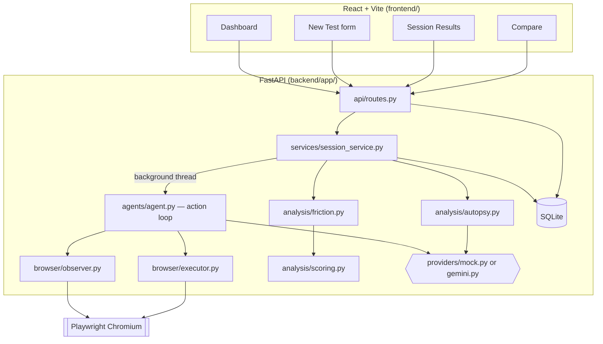

# UX Autopsy — AI-Powered UX Debugger

Run a synthetic user against your website, watch it attempt a real task in a
real browser, and get a deterministic UX score plus a root-cause "autopsy" of
what went wrong — before your real users hit the same friction.

## Problem

UX research is slow and expensive: recruiting testers, watching session
recordings, and manually tagging friction points takes days. Bugs and
confusing flows often ship because nobody actually *tried the task* before
release.

## Solution

UX Autopsy automates the first pass. Give it a URL, a task in plain English,
and a synthetic persona; it drives a real headless browser through the task,
records every action, computes a UX score from deterministic heuristics, and
writes up an autopsy — observed behavior, likely cause, and a concrete
recommendation for each friction point.

## Core workflow

```
Website URL + Task + Persona
        │
        ▼
  Browser automation (Playwright)
        │
        ▼
  Interaction events recorded
        │
        ▼
  Friction detection (deterministic heuristics)
        │
        ▼
  UX score (deterministic formula)
        │
        ▼
  Root-cause analysis (LLM or heuristic narrative)
        │
        ▼
  UX report → Before/after comparison
```

## Features

- **Synthetic personas** — Budget Shopper, Impatient User, Confused
  Beginner, Power User, Mobile User, or a free-text custom persona.
- **Real browser automation** — Playwright drives an actual Chromium
  instance; no simulated DOM.
- **Structured, whitelisted actions** — the agent can only click/type/scroll/
  navigate back/wait/finish/fail against element IDs it was shown. It cannot
  execute arbitrary code or invent selectors.
- **Deterministic UX scoring** — a fixed formula (completion, efficiency,
  navigation, recovery, friction), never altered by an LLM.
- **Deterministic friction detection** — repeated clicks, backtracking,
  hesitation, interaction errors, dead ends, abandonment, excessive actions,
  and explicit task failure.
- **Root-cause "autopsy"** — separates *observed behavior* from *possible
  cause* from *likely root cause* from *recommendation*, using hedged
  language ("likely", "evidence suggests") for anything inferred.
- **Demo mode, no API key required** — a deterministic heuristic provider
  drives the whole pipeline end-to-end against a bundled demo store.
- **Session comparison** — pick up to three completed sessions and compare
  UX scores side by side (e.g. before/after a UI fix).

## Architecture



**Backend**: FastAPI + a thin, thread-safe SQLite layer (no ORM). Each test
run spawns a background thread that drives Playwright through an
observe → decide → act loop, recording every step as an event.

**Frontend**: React + Vite + TypeScript + Tailwind, polling the session
endpoint while a test runs and rendering the score, friction list, timeline,
and autopsy once it completes.

## Tech stack

| Layer | Choice |
|---|---|
| Backend | FastAPI, Uvicorn, Pydantic v2 |
| Browser automation | Playwright (sync API), Chromium |
| Database | SQLite (raw `sqlite3`, no ORM) |
| LLM provider | Google Gemini (`google-generativeai`), optional |
| Frontend | React 18, Vite, TypeScript, Tailwind CSS, Recharts |
| Testing | pytest (unit + API), Playwright Test (E2E) |

## AI architecture — how decisions are made safely

At each step the agent hands the provider a **structured observation**: page
title/URL, a short list of interactive elements tagged with sequential IDs
(`button_01`, `input_02`, `link_01`, …), and recent action history. The
provider must respond with **one structured action**:

```json
{"action": "click", "target": "button_01", "reason": "...", "confidence": 0.9}
```

The executor validates the action against a fixed whitelist
(`click | type | scroll | navigate_back | wait | finish | fail`) and checks
the target ID actually exists on the current page before doing anything.
Malformed or unsafe output falls back to a harmless `wait`. **There is no
path for the model to run arbitrary code or use a raw CSS selector.**

Two providers implement this interface:

- **Mock provider** (`providers/mock.py` + `agents/heuristic.py`) — pure
  Python keyword-matching heuristics. No network calls. This is what powers
  demo mode.
- **Gemini provider** (`providers/gemini.py`) — prompts Gemini for the same
  structured JSON, with the same target-ID validation, and falls back to the
  mock provider's narrative if the model output is unparseable.

The **numerical UX score is never produced by an LLM** — it comes from
`analysis/scoring.py`, a fixed weighted formula. The LLM (or, in demo mode,
the heuristic narrative generator) only ever writes the qualitative summary
and root-cause text, and even then is instructed to hedge inference
("likely cause", "evidence suggests") rather than assert it as fact.

## Browser automation

`agents/agent.py` runs the loop: observe the page → ask the provider for one
action → validate it → execute it → record an event → repeat, capped by
`MAX_ACTIONS` and `MAX_SESSION_SECONDS`. Every step also enforces a
navigation limit and an 8s (configurable) per-action timeout so a stuck page
can't hang a session indefinitely. If the target site fails to load at all,
the session ends in `failed` with the underlying error captured — it never
gets left in a half-finished state.

## UX scoring

`analysis/scoring.py` blends five deterministic sub-scores into one overall
number:

| Component | Weight | What it measures |
|---|---|---|
| Completion | 35% | Did the agent reach `finish`? |
| Efficiency | 20% | Actions taken vs. a reasonable baseline |
| Navigation | 15% | Backtracking and excess page navigations |
| Recovery | 15% | Interaction errors, and whether the agent recovered |
| Friction | 15% | Total weighted friction-point penalty |

## Demo mode

With no `GEMINI_API_KEY` set, `LLM_PROVIDER=auto` resolves to the mock
provider automatically — the app is fully usable out of the box. The
built-in demo target (`GET /api/demo-site/`) is a small, self-contained
electronics store ("PixelMart") with an intentionally low-contrast filter
control and a search-driven checkout flow, purpose-built so the deterministic
heuristic can reliably complete a real task ("find a laptop under ₹60,000
and add it to the cart") end to end. `GET /api/health` reports
`"demo_mode": true` whenever this fallback is active.

## Installation

Prerequisites: Python 3.10+, Node 18+.

```bash
# Backend
cd backend
python -m venv .venv
.venv\Scripts\activate          # Windows; use `source .venv/bin/activate` on macOS/Linux
pip install -r requirements.txt
python -m playwright install chromium

# Frontend (new terminal)
cd frontend
npm install
```

## Environment variables

Copy `.env.example` to `.env` in the project root and adjust as needed (see
that file for the full list). The only one you're likely to set is:

| Variable | Default | Purpose |
|---|---|---|
| `GEMINI_API_KEY` | unset | Enables the real Gemini provider. Omit it to stay in demo mode. |
| `LLM_PROVIDER` | `auto` | `auto` \| `gemini` \| `mock` |

## Running locally

Run these from the **project root** (`ux-autopsy/`), not from `backend/` —
the backend package is imported as `backend.app.*`:

```bash
# Terminal 1 — backend (from the project root, with the venv activated)
python -m uvicorn backend.app.main:app --reload --port 8000

# Terminal 2 — frontend
cd frontend
npm run dev
```

Open http://localhost:5173, click **View Demo** on the dashboard, then
**Start UX Test**. `GET http://localhost:8000/api/health` should report
`{"status":"ok","demo_mode":true}` with no API key configured.

## Testing

```bash
# Backend — unit + API tests (the API test drives a real Playwright session
# against the live demo site, so start uvicorn first, as above)
cd backend
pytest -v

# Frontend type-check
cd frontend
npx tsc -b

# Frontend E2E (requires both servers running)
cd frontend
npx playwright install chromium
npx playwright test
```

## Limitations

- The mock provider's decisions are keyword-matching heuristics, not real
  reasoning — persona differences mostly show up in the Gemini path, not the
  deterministic demo path.
- Screenshots are captured to `backend/screenshots/` for debugging but are
  not currently surfaced in the timeline UI.
- SQLite with a single writer lock is fine for local/demo use, not for
  concurrent production traffic.
- No authentication — this is a local developer/demo tool, not intended to
  be exposed publicly as-is.
- URL validation is intentionally minimal (scheme + host present); this is a
  local UX-testing tool, not a hardened public-facing scanner.

## Future improvements

- Surface per-event screenshots in the timeline for visual review.
- Persona-aware heuristics for the mock provider (not just the LLM path).
- Multi-page task support with richer navigation-graph friction analysis.
- Postgres option for multi-user / production deployments.
